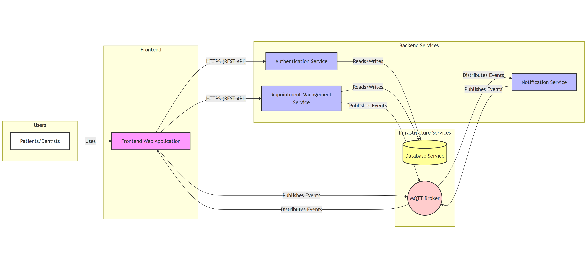

# tooth beacon

## Architecture
The architecture of Tooth Beacon follows a **Service-Oriented Architecture (SOA)** style.

## Social Contract
Our team adheres to a [Social Contract](https://docs.google.com/document/d/126GuPEUvT_JIzgKOcgTzqachW_vbzQNtd1yhpxQrbxg/edit?usp=sharing) that defines our core values, commitments, and collaborative principles. This document guides how we work together to ensure respect, accountability, and a positive team environment.
