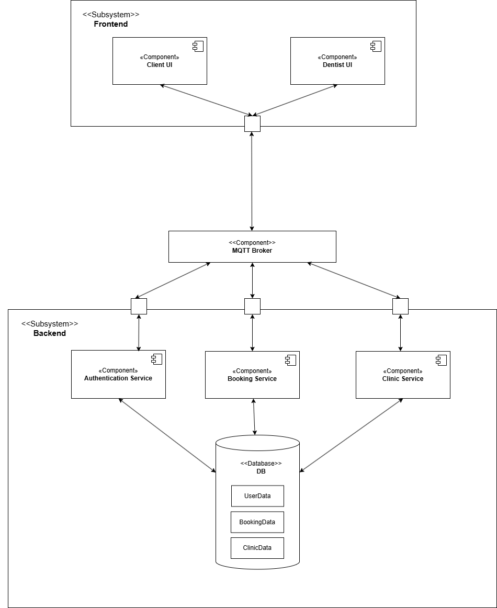
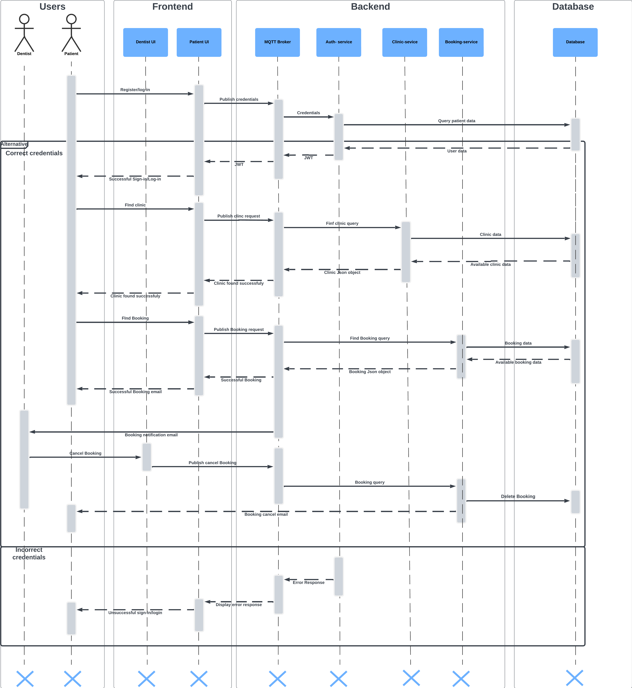
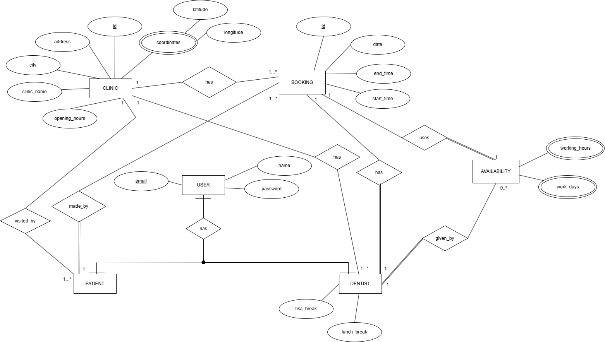
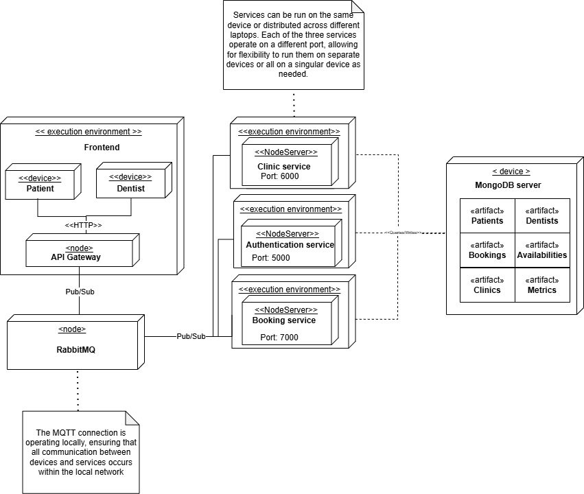

# PEARL FIX

## Architecture
The architecture of Pearl Fix follows a **Service-Oriented Architecture (SOA)** style.

  
<strong>Component Diagram</strong>

  

  
<strong>Sequence Diagram</strong>

  

  
<strong>ER Diagram</strong>

  

  
<strong>ER Diagram</strong>

  

## Social Contract
Our team adheres to a [Social Contract](https://docs.google.com/document/d/1dc2CV5OAU8KKNEKRaAqYfxCZHewU8BqBGJ-avQ7yEzc/edit?usp=sharing) that defines our core values, commitments, and collaborative principles. This document guides how we work together to ensure respect, accountability, and a positive team environment.
