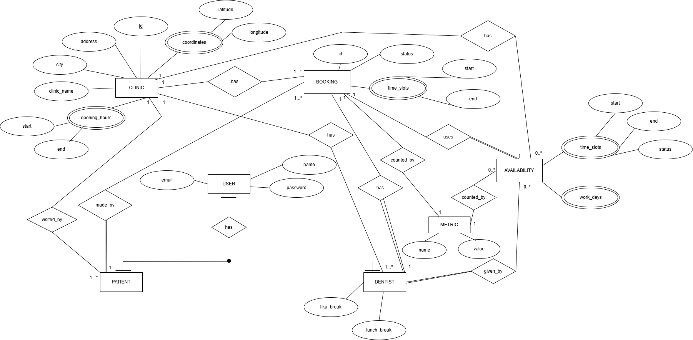

# PEARL FIX

See the wki for detailed information regarding architecture, milestiones and explanations of our different diagrams.

Table of Contents:

- [Pearl Fix](https://git.chalmers.se/courses/dit355/2024/student_teams/dit356_2024_22/tooth-beacon/-/edit/1-architecture-diagram-and-social-contract/README.md#pearl-fix)

  - [Social Contract](https://git.chalmers.se/courses/dit355/2024/student_teams/dit356_2024_22/tooth-beacon/-/edit/1-architecture-diagram-and-social-contract/README.md#social-contract)
  - [Development Team](https://git.chalmers.se/courses/dit355/2024/student_teams/dit356_2024_22/tooth-beacon/-/edit/1-architecture-diagram-and-social-contract/README.md#development-team)
  - [Architecture](https://git.chalmers.se/courses/dit355/2024/student_teams/dit356_2024_22/tooth-beacon/-/edit/1-architecture-diagram-and-social-contract/README.md#architecture)
  - [Purpose](https://git.chalmers.se/courses/dit355/2024/student_teams/dit356_2024_22/tooth-beacon/-/edit/1-architecture-diagram-and-social-contract/README.md#purpose)

## Purpose

Pearl fix is a dental booking service that can be used by users across Sweden. It has a patient and dentist side where the patient can find a clinic through the map and very easily navigate to it and find available times to book, and the dentist can manage their availability and see the upcoming appointments.

## Services

## Architecture
The architecture of Pearl Fix follows a **Service-Oriented Architecture (SOA)** style.

  
<strong>Component Diagram</strong>

  
  
For more detailed information, refer to the [Wiki](https://git.chalmers.se/courses/dit355/2024/student_teams/dit356_2024_22/tooth-beacon/-/wikis/home/%7Bnew_page_title%7DWeekly-Assessments#week-10).

  
<strong>Sequence Diagram</strong>

  

  
<strong>ER Diagram</strong>

  

  
<strong>Deployment Diagram</strong>

  

## Social Contract

Our team adheres to a [Social Contract](https://docs.google.com/document/d/1dc2CV5OAU8KKNEKRaAqYfxCZHewU8BqBGJ-avQ7yEzc/edit?usp=sharing) that defines our core values, commitments, and collaborative principles. This document guides how we work together to ensure respect, accountability, and a positive team environment.

## Development Team

| Name | Username |
| ------ | ------ |
| Celina Labbaci|@labbaci     |
| Manely Abbasi| @manely     |
| Renaa Paktiani| @renaa  |
| Saba Legesse |@sabal |

